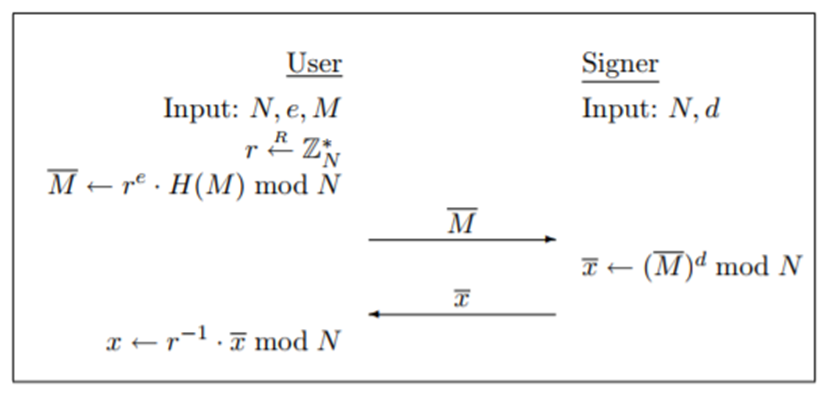
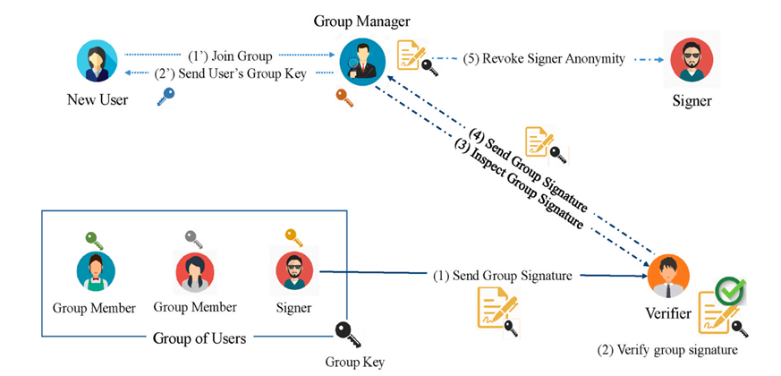
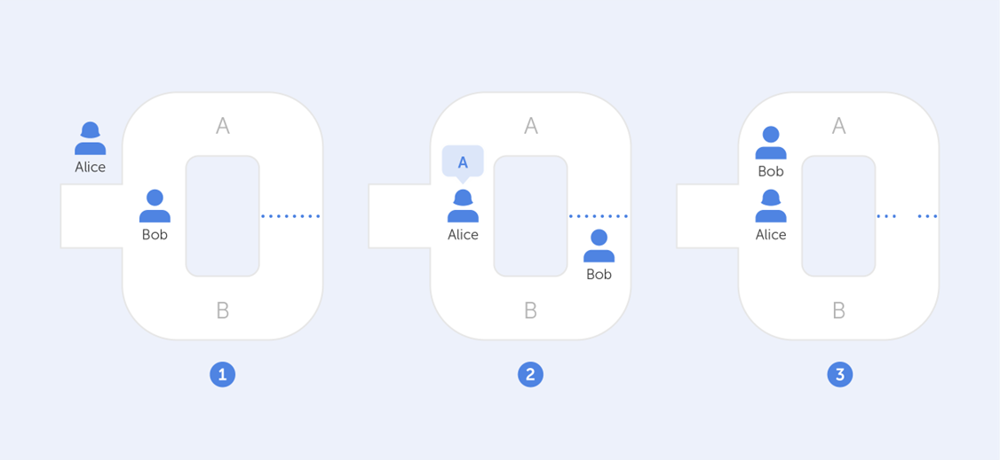
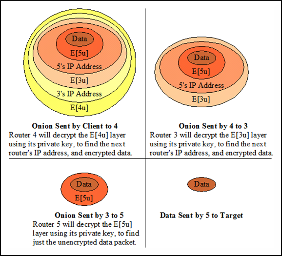
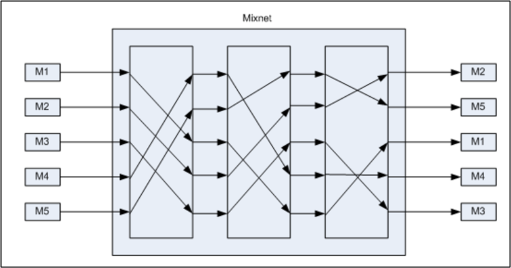

# Privacy-Enhancing Techniques

## Introduction

In the previous chapters we explored the regulatory foundations of privacy, the logic of risk assessment, and the system-level mindset captured by privacy by design. We now move from principles to practice. This chapter introduces **privacy-enhancing techniques**—often abbreviated as PETs—concrete technological mechanisms that support privacy goals across identification, communication, and computation. These are the tools that make privacy by design operational, enabling systems to minimize data collection, hide sensitive information, separate data flows, and aggregate results without exposing individuals.

Privacy-enhancing techniques range from cryptographic primitives to communication protocols and secure computation methods. Some aim to strengthen authentication while reducing disclosure. Others protect the confidentiality and unlinkability of messages. Others enable computations on data without revealing the underlying information. Together, they form a growing toolbox for privacy engineers, security practitioners, and data-intensive services that must comply with data protection requirements while still delivering useful functionality.

This chapter focuses on three families of PETs: **techniques for identification and authentication (with or without anonymity), techniques for secure and private communication, and techniques for privacy-preserving computation**. Database protection and statistical disclosure control will be covered in later chapters.

## Identification, Authentication, and Anonymity

The first family of privacy-enhancing techniques concerns the problem of identifying and authenticating individuals while controlling how much personal information such processes reveal. Authentication is central to security: it ensures that only authorized people access protected resources and helps attribute responsibility in case of misuse or breach. At the same time, unnecessary identity disclosure is itself a privacy risk. PETs in this category attempt to reconcile these two aims—strong authentication with minimal identity leakage.

### Digital Signatures: A Foundation

Most of the techniques in this category build upon **digital signatures**, a standard tool in public key cryptography. A digital signature enables a signer to attach a piece of cryptographic information to a message, proving two things: that the signer is indeed the author and that the message has not been altered. Verification is done with a public key, while signing uses a private key known only to the signer. A public key infrastructure (PKI) links these keys to real-world identities through trusted certificate authorities.

Digital signatures underlie many everyday technologies, from secure web browsing (HTTPS) to electronic administrative services. In their basic form, however, they always tie a signature to an identifiable individual or entity. A range of extensions modify this model to offer stronger privacy.

### Blind Signatures

A **blind signature** allows an authority to sign a message without learning its content. Before sending a message for signing, the requester blinds it using a cryptographic transformation. The signer applies their signature to the blinded message and returns it. The requester then unblinds the result to obtain a valid signature on the original message.

This mechanism is essential when an authority needs to validate the format or legitimacy of something, such as a voting ballot or a digital payment token, without learning the sensitive underlying information. Blind signatures were first proposed for electronic cash systems, where banks could sign digital *coins* without tracking how they were spent. They remain a foundational tool in electronic voting protocols, ensuring that authorities can verify ballots without learning how individuals voted.

### Group Signatures

A **group signature** scheme allows any member of a defined group to sign messages on behalf of the group in a way that ensures verifiability but preserves anonymity. A single public key corresponds to the entire group; each member holds a different private key. When a verifier checks a group signature, they can confirm that someone in the group signed the message, but they cannot identify which member it was.

Group signatures are useful in scenarios where individual identity is irrelevant, unnecessary, or risky to expose. They can support anonymous access to resources, collaborative requests, or group-based credentials. Importantly, group managers can add or revoke members, making the scheme adaptable to real-world organizational structures.

### Identity-Based and Attribute-Based Signatures

In an **identity-based signature** scheme, public keys are arbitrary strings—such as an email address—rather than long random numbers. This eliminates the need for a traditional PKI, since the “identity” embedded in the public key already conveys the needed linking information. While such schemes tie keys to identities more directly, the fact that public keys can be *any* arbitrary string opens the door to more privacy-preserving variants.

Among these variants, **attribute-based signatures** are particularly powerful. Instead of revealing a full identity, signers reveal only specific, certified attributes—such as “is a physician,” “is over 18,” or “is an employee of a given department.” The signature attests that these attributes are valid without exposing who the signer is. This makes it possible to enforce eligibility or authorization rules while minimizing unnecessary identity disclosure.

### Zero-Knowledge Proofs

Zero-knowledge proofs represent a different paradigm. Instead of proving who you are, a zero-knowledge proof allows you to prove that you know some secret or satisfy some property *without revealing the secret itself*. Classic examples include demonstrating knowledge of a secret key without revealing it, or proving that a ballot is well-formed without revealing the vote.

Zero-knowledge proofs are interactive protocols in which a prover convinces a verifier through repeated challenges. Modern constructions allow non-interactive proofs, making them widely applicable in systems such as electronic voting, privacy-preserving identity systems, and blockchain-based smart contracts.

## Secure and Private Communications

The second family of PETs concerns how data move through networks. Even when messages are encrypted, metadata such as who is communicating with whom, when, and how frequently can reveal sensitive information. PETs in this category aim to protect both message content and communication patterns.

### End-to-End Encryption

Traditional communication architectures often encrypted messages between each user and an intermediary server but required the server itself to read the plaintext in order to forward messages. End-to-end encryption (E2EE) eliminates this vulnerability by ensuring that only the communicating endpoints can decrypt the message content. The server acts merely as a router or temporary storage node.

E2EE relies on public key encryption. When sending a message, the sender uses the recipient's public key to encrypt a randomly generated symmetric key (the *digital envelope*), which then protects the actual message. The server cannot decrypt any part of the transmission, reducing the threat of unauthorized access, surveillance, or internal misuse.

Modern messaging systems such as Signal and WhatsApp use variants of this protocol, making E2EE a widely deployed privacy-enhancing technology.

### Protecting Metadata: Anonymous Channels

End-to-end encryption secures content but not metadata. Intermediaries can still observe who is talking to whom. To address this, anonymous communication channels hide user IP addresses and obscure message routing.

The simplest approach is the **virtual private network (VPN)**, which channels all traffic through a proxy server. While this hides the client's IP from destination servers, it shifts trust to the VPN provider, who now sees all traffic patterns. To reduce this concentration of trust, onion routing systems distribute trust across multiple intermediate nodes.

The **Tor network** implements onion routing: the sender wraps the message in multiple layers of encryption, each layer corresponding to an intermediate node. Each node peels off one layer, learning only the next hop and nothing about the original sender or final destination. This prevents any single intermediary from reconstructing the communication path.

A related approach is the **mix network**, which aggregates and shuffles messages before forwarding them. Mix networks break the timing correlations that might otherwise reveal communication links, making them valuable in applications such as electronic voting.

## Privacy-Preserving Computation

The third family of PETs enables data processing without revealing the underlying data. This is essential in scenarios where sensitive data must be analyzed by untrusted servers, shared across organizational boundaries, or combined to compute aggregate information without exposing individual contributions.

### Homomorphic Encryption

Homomorphic encryption schemes allow mathematical operations to be performed directly on encrypted data. After computation, the result, which is still encrypted, can be sent back to the data owner, who decrypts it to obtain the output as if the operations had been performed on the plaintext.

Some schemes support only one type of operation, such as addition or multiplication. These are called **partially homomorphic** schemes; classic examples include RSA (multiplication) or Paillier (addition). More recently, **fully homomorphic encryption** (FHE) schemes have been developed that support both. FHE is computationally heavy but rapidly improving, and its resistance to quantum attacks makes it attractive for long-term uses.

Homomorphic encryption is suitable for numerical data and provides strong confidentiality even when outsourcing computation to untrusted environments.

### Secure Multi-Party Computation

Secure multi-party computation (MPC) allows several parties to jointly compute a function on their combined inputs without revealing those inputs to one another. Each party learns only the final output and nothing more.

MPC protocols can compute tasks such as averages, sums, or complex Boolean functions. They rely on advanced cryptographic tools such as garbled circuits and often build upon secret sharing mechanisms. Although historically too inefficient for widespread use, MPC has seen rapid improvement, with practical deployments in areas such as health data collaboration, pandemic analytics, and joint fraud detection.

The key idea is collaboration without disclosure: multiple entities can benefit from shared insights while retaining local control over sensitive data.

### Secret Sharing

Secret sharing schemes split a secret into multiple *shares*, distributing them among participants. Only certain authorized subsets, defined by an *access structure*, can reconstruct the secret. Unauthorized subsets learn nothing.

The most common pattern is threshold sharing: from *n* shares, any *k* can reconstruct the secret, while fewer provide no information. Secret sharing serves as a foundational building block for MPC, threshold signatures, and distributed key management.

## Bringing PETs Into Privacy by Design

Privacy-enhancing techniques give concrete form to the strategies introduced in earlier chapters. They help minimize data collection by reducing the amount of identity information needed for authentication. They enforce hiding through strong cryptography and anonymous routing. They enable separation by distributing trust across multiple nodes or entities. They support aggregation by allowing computations on encrypted or decentralized data.

Importantly, PETs are not standalone solutions. Their effectiveness depends on proper integration into system architecture, careful risk assessment, and ongoing governance. They are also not universal: each technique has strengths, weaknesses, computational considerations, and appropriate use cases.

The next chapters will turn to **database protection and anonymization**, where statistical approaches complement the cryptographic techniques introduced here. There, we will explore attacks based on re-identification and attribute inference and study methods for making datasets safe to publish or share.
