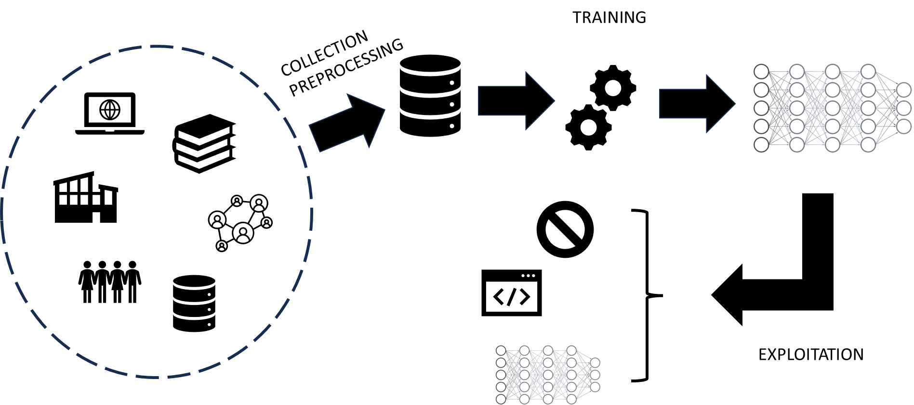
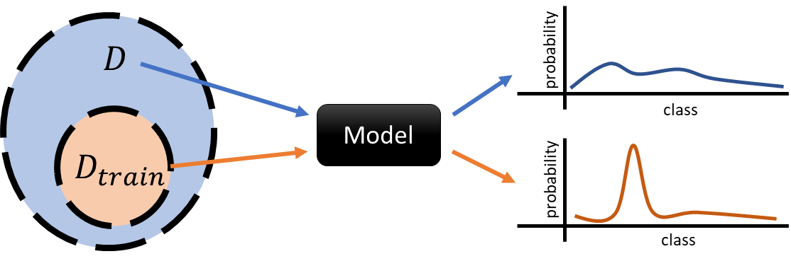
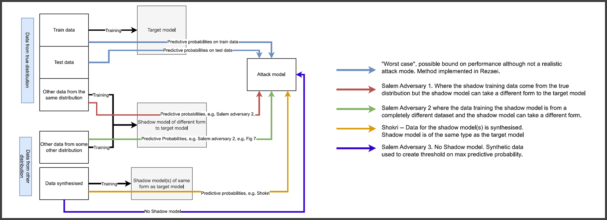
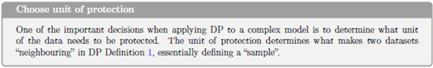
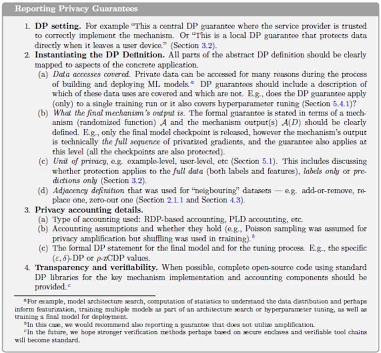

# Privacy in machine learning

Machine learning (ML) has become a cornerstone of modern data processing, powering applications from recommendation systems and medical diagnostics to language models and autonomous vehicles. However, as these systems rely heavily on large volumes of data—often including sensitive personal information—they introduce new vectors of privacy risk. Privacy in machine learning concerns not only the protection of data during training but also the potential leakage of private information through the trained model itself. This session explored the privacy threats across the machine learning lifecycle and the technical approaches developed to mitigate them.

Privacy Risks in the ML Lifecycle

The privacy risks in machine learning can be grouped according to the stages of the model lifecycle:

Data collection and preprocessing – where raw data may contain personally identifiable information (PII) or confidential attributes.

Model training – where data is used to optimize model parameters, and sensitive patterns may be memorized.

Model deployment and inference – where trained models are exposed via APIs or publicly released, creating new avenues for leakage.

At each stage, adversaries can exploit vulnerabilities to infer or reconstruct private information.

During data collection, the classic risks of data privacy still apply: excessive collection, inadequate anonymization, and linkage with external sources can expose individuals. During training, however, new risks emerge. Machine learning algorithms, particularly deep neural networks, have the capacity to memorize parts of the training data, especially when overfitting. This memorization can lead to unintentional leakage of sensitive details, such as names or unique patterns, into the model’s parameters.

Once a model is deployed, privacy threats shift to inference-time attacks. Even without direct access to the data or parameters, attackers can probe the model through queries and exploit statistical signals in its outputs to learn about the underlying data. These are known as model inversion, membership inference, and reconstruction attacks.

Types of Privacy Attacks on Machine Learning Models

Membership Inference Attacks (MIA)
These attacks aim to determine whether a specific data record was part of a model’s training dataset. Given a model and a data point, an attacker observes the model’s confidence or prediction behavior. Typically, models are more confident or accurate on examples they have seen during training, especially if they are overfitted. For instance, an attacker could determine whether a patient’s medical record was used to train a disease classifier, potentially revealing their participation in a sensitive study. This type of attack compromises the confidentiality of training data membership rather than its content.

Attribute Inference Attacks
Here, the goal is to infer unknown or hidden attributes of an individual based on what the model reveals. For example, by observing outputs of a salary prediction model that uses features like education and job title, an attacker might deduce an individual’s missing attribute, such as gender or age, if the model implicitly captures correlations between those variables. Attribute inference attacks exploit the statistical dependencies learned by the model.

Model Inversion and Reconstruction Attacks
These are more aggressive attacks that aim to reconstruct sensitive features or even entire data samples from a trained model. For example, given access to a facial recognition model, an attacker can use gradient-based optimization to reconstruct approximate images of faces that were used in training. Similarly, in language models, it is possible to extract fragments of training data—such as names, addresses, or verbatim text—by prompting the model appropriately. This phenomenon has been demonstrated in large generative models, where memorized sequences from training datasets (e.g., confidential documents or private code) have been unintentionally reproduced.

Data Poisoning and Backdoor Attacks
While not directly a privacy violation, these attacks involve injecting malicious data during training to manipulate model behavior or cause it to leak information under certain triggers. Poisoning can bias the model or embed “backdoors” that allow specific queries to retrieve sensitive information.

The effectiveness of these attacks depends on the attacker’s access level.

In black-box attacks, the attacker can only query the model and observe outputs.

In white-box attacks, the attacker has full access to model parameters, gradients, or training code.
Even black-box attacks, however, can achieve surprisingly high success rates, particularly in overfitted models.

Mitigation Strategies and Privacy-Preserving Techniques

To mitigate these risks, several complementary strategies have been developed. They differ in the level at which they intervene—data, model, or system—and in how they balance privacy protection with model performance.

Data Anonymization and Preprocessing
Before training, sensitive data can be anonymized using traditional methods (such as generalization, suppression, or perturbation) to remove explicit identifiers. However, anonymization alone is insufficient in high-dimensional or unstructured data contexts, since models can still learn to identify individuals indirectly.

Differential Privacy in Model Training
The most rigorous framework for privacy-preserving learning is Differentially Private Stochastic Gradient Descent (DP-SGD). This approach incorporates differential privacy directly into the training process. During each gradient update, the algorithm clips gradients (limiting the influence of any single training example) and adds random noise. The cumulative effect ensures that the model’s parameters reveal almost nothing about any particular record in the training data.

The strength of the guarantee is again controlled by the privacy parameter ε, which quantifies how much information about a single individual can be inferred. Smaller ε means stronger privacy but greater noise, potentially degrading model accuracy. This trade-off must be carefully tuned. DP-SGD is now implemented in major ML frameworks (TensorFlow Privacy, PyTorch Opacus) and has been adopted by companies like Apple and Google for analytics and personalization.

Federated Learning
Federated learning (FL) offers an architectural solution that complements differential privacy. Instead of centralizing all data on a single server, FL keeps data local—on users’ devices or in institutional silos—and sends only model updates (parameter gradients) to a central aggregator. The global model is updated using these aggregated contributions, so raw data never leaves its origin.

While this decentralization enhances privacy, FL is not immune to attacks: model updates can still leak information about the underlying local data. To strengthen protection, secure aggregation protocols and differentially private federated learning are used. Secure aggregation uses cryptographic techniques to ensure that the server only sees the sum of updates, not any individual’s contribution. When combined with DP, federated learning achieves strong privacy while preserving collaborative learning benefits.

Secure Multiparty Computation (SMPC) and Homomorphic Encryption
These cryptographic PETs enable collaborative model training or inference without exposing raw data. In SMPC, multiple parties jointly compute a model (e.g., logistic regression) over their combined datasets, but each keeps its data secret, revealing only encrypted shares of intermediate results. Homomorphic encryption goes further, allowing computations to be performed directly on encrypted data; the model can produce encrypted outputs that only the data owner can decrypt. Although computationally expensive, these methods are increasingly practical for small to medium-sized models.

Model Regularization and Privacy-Aware Design
Simple training practices—such as dropout, early stopping, and model compression—also help reduce memorization, indirectly improving privacy. By preventing overfitting, models are less likely to remember specific training examples. Furthermore, access control and query auditing at the API level can detect suspicious query patterns indicative of inference attacks.

Trade-offs and Limitations

Every privacy-preserving ML approach involves trade-offs. Adding noise (as in differential privacy) reduces accuracy; federated learning increases communication and computation overhead; and encryption-based methods can be prohibitively slow. The appropriate balance depends on context: in healthcare or finance, stronger privacy is prioritized even at the cost of performance; in consumer applications, small privacy budgets may suffice for practical purposes.

Moreover, while differential privacy provides strong mathematical guarantees, it does not protect against all attack types—particularly those exploiting side channels or poor implementation. Similarly, federated learning can protect data locality but not against malicious participants or compromised devices.

The Emerging Concept of Model Privacy

This session concluded by emphasizing that privacy in machine learning extends beyond protecting training data—it also involves protecting the models themselves. Trained models may encode sensitive intellectual property or proprietary insights, which can be stolen through model extraction attacks. Thus, privacy preservation now encompasses both data privacy and model privacy, forming a unified security objective.

Modern privacy-aware ML design integrates multiple layers: data minimization at collection; anonymization or obfuscation during preprocessing; privacy-preserving learning (DP-SGD, FL, SMPC); and monitoring or access control at deployment. These techniques collectively operationalize the principle of privacy by design in artificial intelligence systems—ensuring that privacy is not an afterthought but an inherent property of model architecture and learning algorithms.

As AI systems grow more capable and pervasive, embedding privacy protection at every stage becomes essential—not only to comply with regulation but also to maintain trust in algorithmic decision-making. The field of privacy-preserving machine learning thus represents the convergence of data protection law, cryptography, and statistical learning theory—an evolving discipline at the heart of ethical AI.

Machine Unlearning: Making Models Forget

A particularly challenging aspect of privacy in machine learning arises after a model has been trained. Even if strong privacy-preserving methods are applied during data collection and training, there are scenarios where certain data points must later be deleted — for example, if a user withdraws consent under the GDPR’s “right to be forgotten”, or if sensitive or erroneous records are discovered post-training. In traditional ML pipelines, deleting data from the dataset is straightforward, but ensuring that its influence is erased from the trained model is far more complex. This problem is known as machine unlearning.

The core idea of machine unlearning is to remove the impact of specific data samples from a model’s parameters without retraining from scratch. Naively retraining is theoretically correct — if the model is retrained without the unwanted data, it no longer depends on it — but this approach is computationally infeasible for large-scale models, which may take days or weeks to train. Efficient unlearning aims to achieve a similar effect more quickly, ideally with localized updates or algorithmic adjustments.

There are several strategies for achieving this goal, each with different trade-offs between efficiency, completeness, and scalability:

Exact Unlearning by Retraining Subsets
Some methods retrain only the affected components of the model. For example, in ensemble methods like random forests or gradient boosting, individual trees or weak learners that used the deleted data can be retrained independently. Similarly, in modular neural networks, layers or submodels can be partially retrained to remove specific information. This approach achieves precise unlearning while reducing computational cost compared to full retraining.

Approximate or Certified Unlearning
A more recent line of work seeks formal guarantees that a model behaves as if it had been trained on the reduced dataset, up to a bounded error. One approach uses influence functions, which approximate how much each training point affects model parameters. By inverting these influences, it is possible to “roll back” the effect of a deleted sample. While not exact, this provides quantifiable, provable bounds on residual information.

Gradient-Based Unlearning
In differentiable models such as neural networks, unlearning can be approached by performing gradient ascent on the deleted samples — that is, updating the model in the direction that undoes their contribution. This technique can selectively erase features or patterns associated with the removed data but risks destabilizing the model if not carefully controlled.

Data Partitioning and Sliceable Training
Another promising direction involves designing models that are unlearning-friendly from the outset. Data is divided into partitions or “slices,” and the model tracks which parameters depend on which slice. If data from one partition needs to be forgotten, only the corresponding parameter subset is updated. This design principle, sometimes called machine unlearning by design, aligns directly with privacy by design philosophy — anticipating future deletion requests rather than treating them as afterthoughts.

Privacy, Accountability, and the Right to Be Forgotten

Machine unlearning connects technical ML research directly to data protection law. Under the GDPR, data subjects have the right to have their personal data erased when it is no longer necessary for the purposes for which it was collected or when consent is withdrawn. For machine learning systems that derive knowledge from user data, this creates a profound technical challenge: ensuring that the effects of personal data are eliminated from both stored datasets and trained models.

From a compliance perspective, organizations must be able to demonstrate that a model no longer depends on deleted data — a task that requires verifiable procedures or certified unlearning techniques. This pushes the field toward developing measurable metrics for forgetting effectiveness. Emerging research explores auditing tools that can detect whether a model still contains traces of removed samples, using reverse inference or statistical tests.

In practice, many operational systems today achieve partial compliance by retraining models periodically or by limiting training data retention to short cycles. Others use federated learning architectures, where individual clients can simply stop participating, effectively “forgetting” their data in subsequent rounds. Still, the research goal remains to achieve instant, verifiable unlearning at the model level.

The Future of Privacy-Aware Learning

Machine unlearning represents the next step in the evolution of privacy-preserving machine learning — complementing preventive techniques like differential privacy and federated learning with corrective ones that restore privacy retroactively. In an ideal privacy-aware ecosystem, users could not only trust that their data is protected during training but also exercise ongoing control: contributing, modifying, or removing data at will, with immediate effect on deployed models.

Conceptually, unlearning closes the loop between data protection principles (such as purpose limitation, minimization, and the right to erasure) and technical machine learning practices. It ensures that models remain compliant, ethical, and adaptive to user control throughout their lifecycle. Although efficient unlearning is still an open research challenge—particularly for large deep networks and generative models—it embodies the ultimate vision of privacy by design: systems that can both learn and forget responsibly.

## Machine learning pipeline

## Threats

Several studies, such as Shokri et al. (2017), among many others, have shown that trained ML models may leak personal information from the data used to train them.

- Membership inference attacks
- Attribute inference attacks
- Reconstruction attacks

While we will mostly refer to neural networks and deep learning most of the privacy issues described apply to other models.
Most classification models output the decisions’ confidence.
Other models directly leak private information, such as kNN and SVMs, which include some (or all) training data as part of the model.
DP techniques easily apply to differentiable model training (e.g., SGD).

### Threat model

- Type of access to the model
  - Black-box access → prediction probabilities, logits in DL.
  - White-box access → weights, activations, gradients during training, known architecture.
- Learning architecture
  - Centralized learning → published trained model, API-only access.
  - Federated learning → open to white-box attacks
- Knowledge of data distribution
  - Availability of public data, synthetic data, correlations in attributes, etc.

## MIA

MIAs aim to determine whether a data point was present in the training data used to build a model. 
Given a point in the distribution and a trained model, the attack returns 1 bit of information. 

Although this may not at first seem to pose a serious privacy risk, the threat is clear in settings such as health analytics where the distinction between case and control groups could reveal an individual's sensitive conditions.
Successful MIAs open the door to other attacks, such as attribute inference and reconstruction attacks.
They can also be used to detect copyright violations or to measure unlearning success.

*Experiment* (Membership Experiment $Exp^M(\mathcal{A},A,n,\mathcal{D})$).
Let $\mathcal{A}$ be an adversary, $A$ a learning algorithm, $n$ be a positive integer, and $\mathcal{D}$ be a distribution over data points $(x,y)$. The membership experiment proceeds as follows:
   1. Sample $S \sim \mathcal{D}^n$, and let $A_S = A(S).
   2. Choose $b \leftarrow \{0,1\}$ uniformly at random.
   3. Draw $z \sim S$ if $b=0$, or $z \sim D$ if $b=1$.
   4. $Exp^M(\mathcal{A},A,n,\mathcal{D})$ is $1$ if $\mathcal{A}(z, A_S, n, \mathcal{D}) = b$ and 0 otherwise. $\mathcal{A}$ must output either $0$ or $1$. 

*Membership advantage*. The membership advantage of $\mathcal{A}$ is defined as

$$Adv^M(\mathcal{A}, A, n, \mathcal{D}) = 2 \Pr[Exp^M(\mathcal{A}, A, n, \mathcal{D})=1]-1$$

where probabilities are taken over the coin flips of $\mathcal{A}$, the random choices of $S$ and $b$, and the random data point $z \sim S$ or $z \sim D$.

Equivalently, the right-hand side can be expressed as the difference between $\mathcal{A}$'s true and false positive rates

$$ Adv^M = \Pr[\mathcal{A}=0|b=0] - \Pr[\mathcal{A}=0|b=1]$$

where $Adv^M$ is shortcut for $Adv^M(\mathcal{A}, A, n, \mathcal{D})$.

### Connection to overfitting

Overfitting has been shown to predict attacker advantage (Yeom et al. 2018).
In black-box attacks, prediction probabilities (for any classifier) or prediction loss are used to determine membership.
Models, especially when overfit to the training data, display different behavior when encountered with previously seen data.

## Attribute inference attacks

In an attribute inference attack, the adversary uses a machine learning model and incomplete information about a data point to infer missing information.
For example, the adversary is given partial information about an individual's medical record and attempts to infer the individual's genotype by using a model trained on similar medical records.
Can be obtained from successful MIA.

## Reconstruction attacks

Reconstruction or model inversion attacks attempt to build the whole training dataset from the information leaked by the trained model.
Can also be obtained from MIAs.
Often use GANs.

## Approximate differential privacy

Let $\epsilon$ be a positive real number and $\mathcal{A}$ be a randomized algorithm that takes a dataset as input. Let  $im \mathcal{A}$ denote the image of $\mathcal{A}$. The algorithm $\mathcal{A}$ is said to provide $(\epsilon,\delta)$-differential privacy if, for all datasets $D_1$ and $D_2$ that differ on a single element (i.e., the data of one person), and all subsets $S \subset im \mathcal{A}$:

$$\Pr[\mathcal{A}(D_1) \in S] \le e^{\epsilon}\Pr[\mathcal{A}(D_2) \in S]+\delta $$

where the probability is taken over the randomness used by the algorithm.

  - $\epsilon$ should be close to $0$ and $\delta << 1/|D|$ 
  - Sequential composition: applying mechanisms that are ($\epsilon_i,\delta_i)$-differentially private results in $(\sum \epsilon_i, \sum \delta_i)$-differential privacy.
  - Resistance to post-processing: no processing done on data released by a differentially private mechanism will degrade the privacy guarantee.
  - $(\epsilon,\delta)$-DP is often achieved via the Gaussian mechanism:

$$ \mathcal{M}_{Gauss} = f(x) + \mathcal{M}\left(0, \frac{2\ln(1.25/\delta)(\Delta f)^2}{\epsilon^2} \right) $$

  - Differential privacy bounds the probability of identifying any individual record within a database, parametrized by $\epsilon$.
  - Results of a DP function are unaltered by the presence or absence of any single record.
  - This looks ideal to protect against MIAs in ML.
  - $\epsilon$ closer to 0 provide more privacy at the cost of less data utility.
  - Relaxations to DP attempt to mitigate this.
  - In ML, $(\epsilon,\delta)$-DP has been applied to stochastic gradient descent, together with the moments accountant.

Yeom provides a bound for the attacker’s advantage in DPML:

$$Adv \le e^\epsilon - 1$$

$Adv=1$ implies privacy is broken. Therefore, the bound is irrelevant for:

$$ \epsilon \ge \ln{⁡2} \approx 0.7 $$

  - DP-SGD introduces several new hyperparameters to optimize: $\sigma$, $\epsilon$, $\delta$, $q=L/N$, $C$, $T$, which are interdependent.
  - To correctly compute the noise to add and not lose additional utility, it should be computed on a per example basis, thus losing most of the benefits of parallelization 
  - Training times increase of 10x—50x.
  - Relaxations of DP make the privacy guarantees even less clear, e.g., the moments accountant.
  - High accuracy loss, especially if choosing adequate budgets.

## Machine unlearning

An unlearning algorithm takes as input a pre-trained model and one or more samples from the train set to unlearn (the "forget set").
From the model, forget set, and retain set, the unlearning algorithm produces an updated model.
An ideal unlearning algorithm produces a model that is indistinguishable from the model trained without the forget set.
MIA advantage used as a metric.

## Federated learning

Federated learning (FL) is a machine learning setting where many clients (e.g., mobile devices or whole organizations) collaboratively train a model under the orchestration of a central server, while keeping the training data decentralized. 
FL embodies the principles of focused data collection, minimization, separation, and aggregation and can mitigate many of the systemic privacy risks and costs resulting from traditional, centralized machine learning and data science approaches.

While FL helps with privacy, it still has some issues to consider:
Privacy issues → White-box access to clients’ contributions.
Security issues → Byzantine, poisoning, adversarial attacks.
Homomorphic encryption, secure multiparty computation, differential privacy at the client level, etc. have been used to tackle some of the privacy issues.
Outlier and anomaly detection mechanisms can be used to detect security attacks.
Some protections against these issues have a negative effect on the other.

Secure aggregation protects against a honest-but-curious model manager.
Still, MIAs, AIAs, and reconstruction attacks are still feasible on the aggregated model.
Secure aggregation may prevent the model manager from protecting against security attacks (e.g., byzantine & poisoning attacks).

