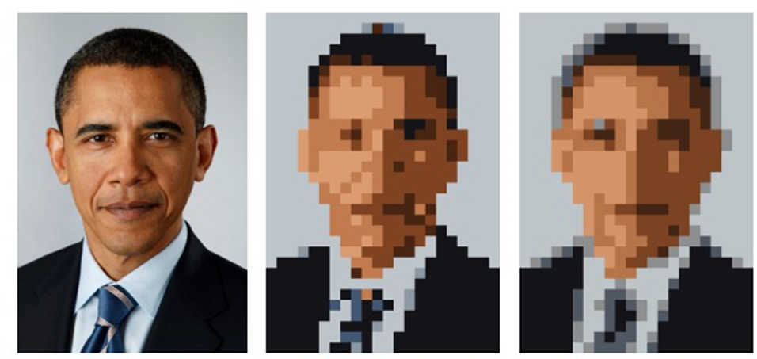
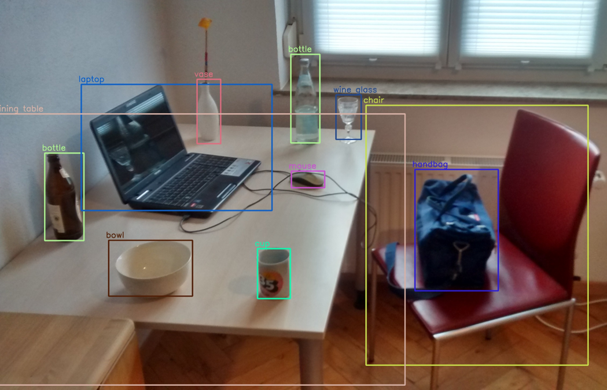
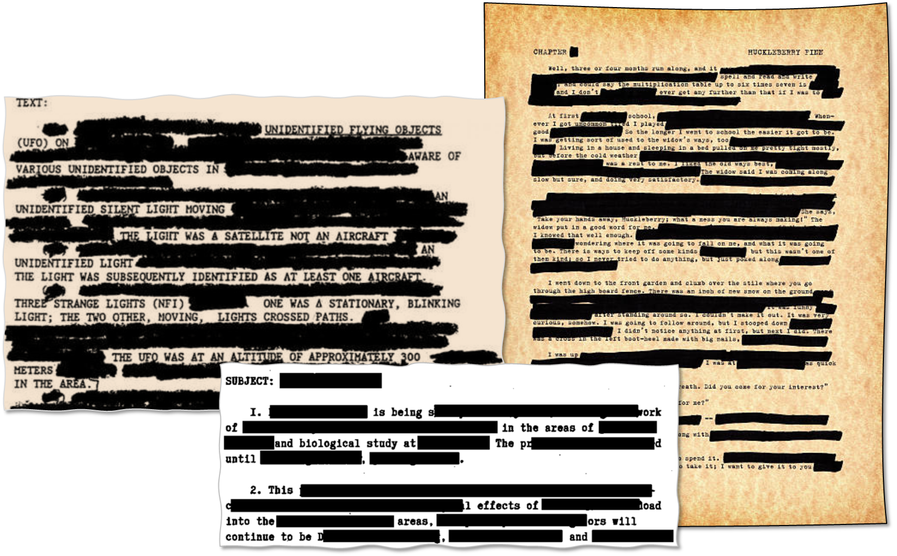
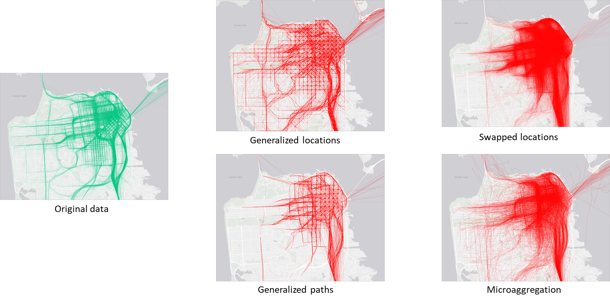

# Privacy in unstructured data

In this topic, we describe privacy issues and protections for unstructured data.
We will talk about images, text, location, and genetic data.
Privacy metrics and risks are harder to characterize in such data, and protection mechanisms often make use of combinations of techniques, such as generalization, noise addition, and synthetic data generation.
Current advances in DL are offering new tools to deal with many of these issues.

## Privacy of image data

Image data can be very disclosive.
Besides identifying a person from a photo, their location can be found out from the background (OSINT) or from metadata.
Metadata can also reveal the time a photo was taken, the type of camera, whether there is any manipulation, etc.
Even artifacts in an image, such as dead pixels, can be used to link two photos taken with the same device.

Historically, the identity of people appearing in images has been protected by blurring or pixelating regions of the images (the background can be blurred, too) manually.

Automatic object detection and image segmentation can be used to ease this process. 
The combination of language models capable of describing images with image segmentation models makes this process even easier.

Some studies might require clean images.
Generative models, such as GANs or diffusion models, can generate whole or partial images (inpainting) of objects that share the properties of the original but that do not exist.

In the case of medical images, while it is possible to generate synthetic data, it is not always desirable.
Additionally, medical images, such as X-Rays, are not really disclosive, except for any metadata shipped along the image data.

### Medical images (DICOM)

DICOM (Digital Imaging and Communications in Medicine) is a standard for handling, storing, printing, and transmitting information in medical imaging.
It includes a file format definition and a network communications protocol.
The communication protocol is an application protocol that uses TCP/IP to communicate between systems.
DICOM files can be exchanged between two entities that can receive image and patient data in DICOM format.

A DICOM data object consists of several attributes, including items such as name, ID, etc., and one special attribute containing the image pixel data.
One of the attributes, the modality, represents the DICOM file type.
Biomagnetic imaging
Bone Densitometry (X-Ray)
Computed Tomography
Electrocardiography
Endoscopy

Other DICOM image metadata include information about the patients, which can be removed.
Patient’s Name
Patient ID
Patient’s Birth Date
Patient’s Sex
Patient’s Size
Patient’s Weight
Patient’s Address
Patient’s Mother’s Birth Name

Additionally, images might contain burned-in annotations, which must be removed.

DICOM libraries and editor software include tools to anonymize DICOM images.
DICOM Library, https://www.dicomlibrary.com
Sante DICOM Editor, https://www.santesoft.com/win/sante-dicom-editor/howto/anonymize.html

## Privacy of text data

The task of protecting the private information of the individuals mentioned in text documents are referred to in the literature as document redaction, sanitization, or anonymization.
Whatever the name, it consists of two steps:
detecting (potentially) disclosive pieces of text, and
masking those pieces appropriately.

For many years textual data protection has been a highly manual process, and it still is.
Usually, several human experts review the text and mask all items they deem usable to re-identify individuals and/or disclose confidential data on them.
To reduce the burden of human experts, some systems that make use of Named Entity Recognition (NER) were introduced.
NER was created to extract structured information, like person and organization names, locations, times or dates, from an unstructured text.

Early NER systems were based on handcrafted rules or regular expressions. For instance, times can be identified using the following pattern: “at” + digits + “am”/“pm”. Up until 2000, handcrafted rule systems offered the best results.
Statistical approaches subsequently took over. In statistical NER systems, models such as HMM (hidden Markov models) are trained to locate a specific type of entity.
With the development of deep learning neural networks, recurrent neural networks (RNN) and extensions of them such as long short-term memory (LSTM), and now Transformers, surpassed the accuracy of statistical NER systems.

### Named entity recognition

State of the art is based on transformers like BERT and ELMo.
These are pre-rained on large amounts of data and characterize words according to their context.
These are general-purpose NLP models, that can be tailored or fine-tuned to solve multiple tasks including NER, but also sentiment analysis, text  generation, question answering, summarization, or machine translation.

Hassan et al. (2023) propose a more general and flexible solution for textual data protection.
By means of word embeddings they build vectors that numerically capture the semantic relationships of the textual terms appearing in a collection of documents.
Then they evaluate the disclosure caused by the textual terms on the entity to be protected according to the similarity between their vector representations.
Their method limits the semantic loss of the document by replacing disclosive terms with privacy-preserving generalizations.

## Privacy of location data

Trajectory data is highly unique and regular.
Additionally, all points in a trajectory are both quasi-identifiers and sensitive information.
Knowing only a few locations may allow attackers to re-identify persons and to infer additional information.

## Privacy of genetic data

Genomic data is collected from biological samples in the health-care system and often shared with research organizations.
Other sources of genetic data come from direct-to-consumer tests (e.g., MyHeritage.com) or from law enforcement or forensic investigations.

SNPs (single nucleotide polymorphism) are locations within the human genome where the type of nucleotide present (A,T,G, or C) can differ between individuals.
SNPs are the most common type of genetic variation found among people. 
SNPs occur roughly every 300 nucleotides, and since there are 3 billion nucleotides in the human genome, there are approximately 10 million SNPs.
Over 99% of the genome is identical between individuals, so SNPs provide researchers a way to study the genetic root of the differences that are apparent across the human race.
Although most SNP’s have no effect on health, they can be important tools for genetic research.
For example, SNPs are the basis for genome wide association studies (GWAS) that allow researchers to determine regions of the genome that may be important in disease development.
Since SNPS are hereditary and shared by individuals of common descent, they can also be used to track ancestry.

Privacy risks of genomic data processing:
Re-identification. Sharing individual-level genomic data, even without explicit identifiers, creates an opportunity for re-identification. For example, a data recipient could infer phenotypic information from genomic data (or vice versa) that may be leveraged for re-identification purposes.
Membership inference. In genome–phenome investigations, such as GWAS, researchers commonly publish only summary statistics that are useful for meta-analyses. However, these might be vulnerable to membership inference attacks, whereby it is possible to discover an identified target’s participation in the GWAS as part of a potentially sensitive group.
Reconstruction and familial search. Due to the similarity of relatives’ genomic records, even if someone’s genomic record has never been shared or even generated, their genotypes and predispositions to certain diseases can be inferred to a certain degree from their relatives’ shared genotypes.

